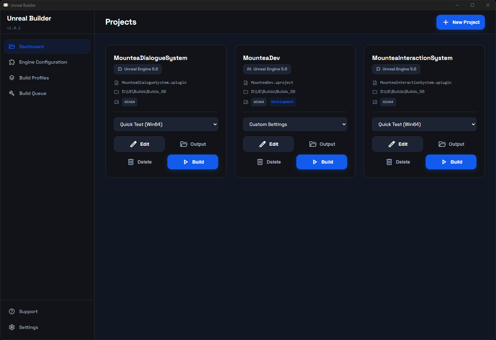
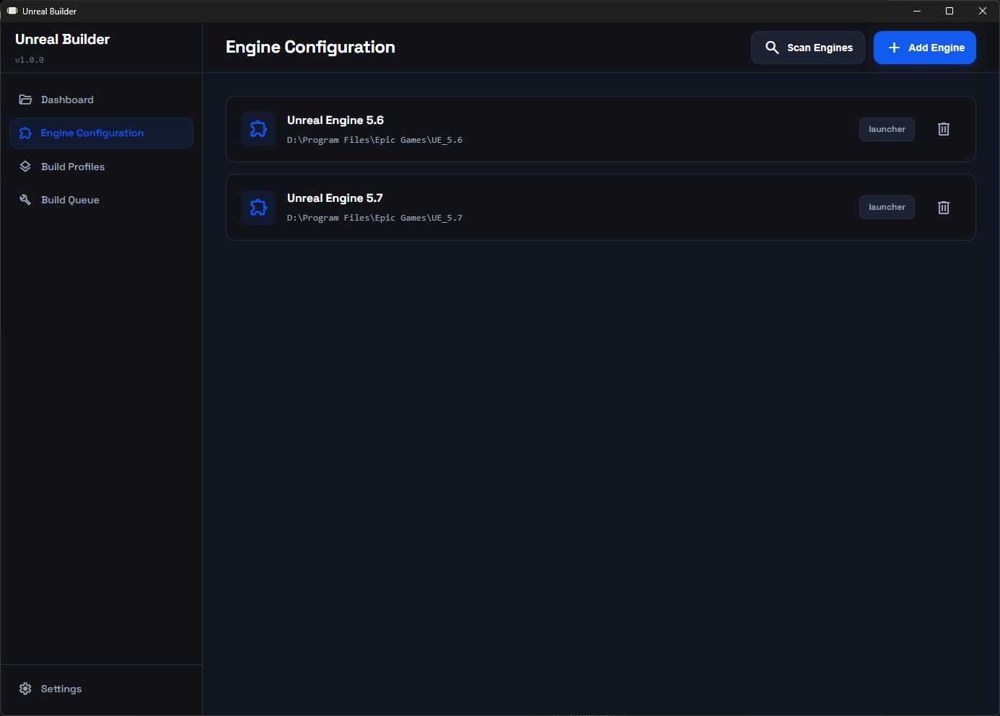
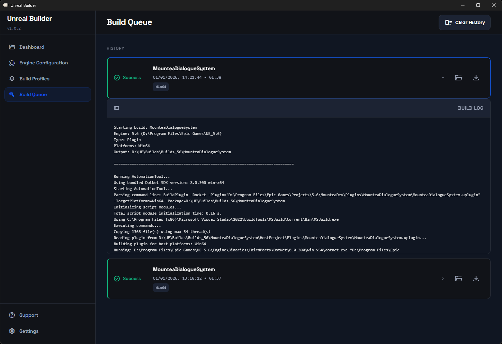
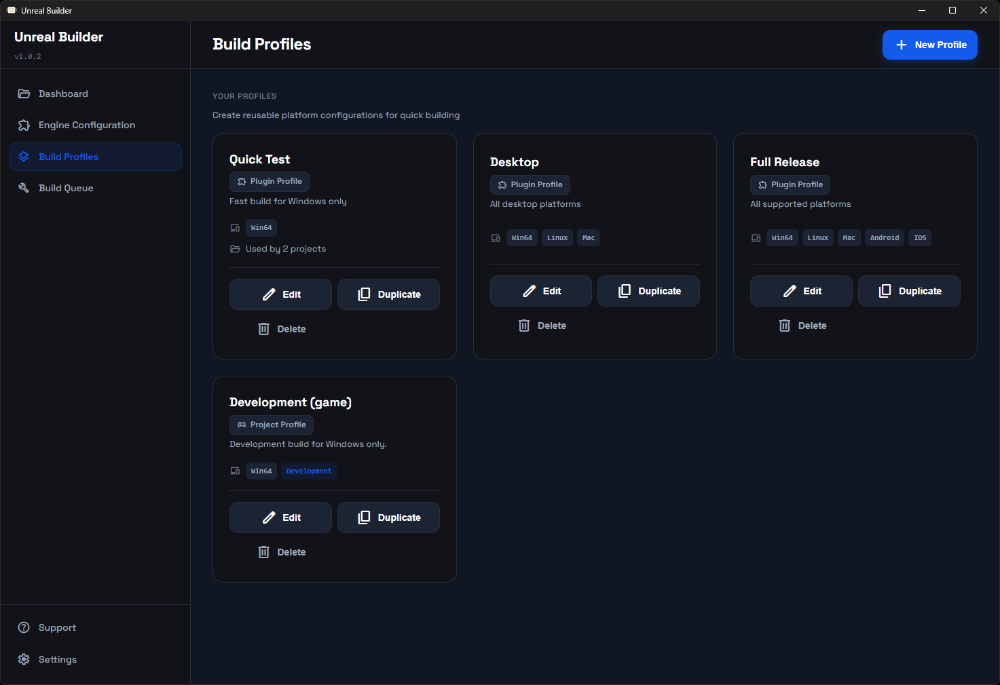
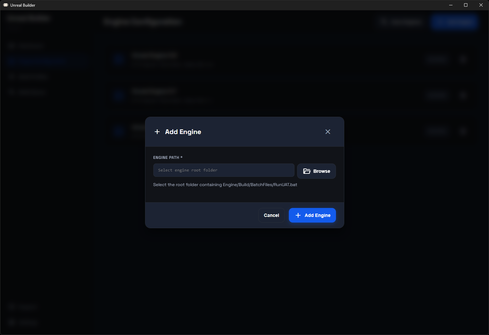
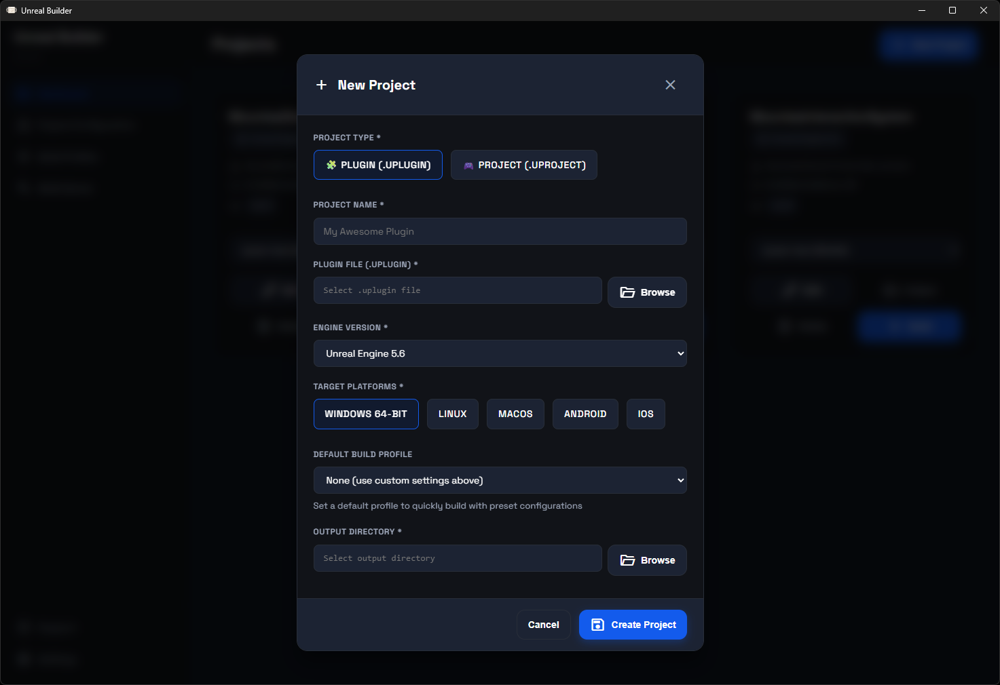
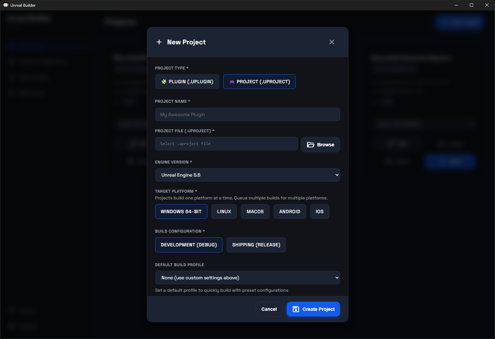
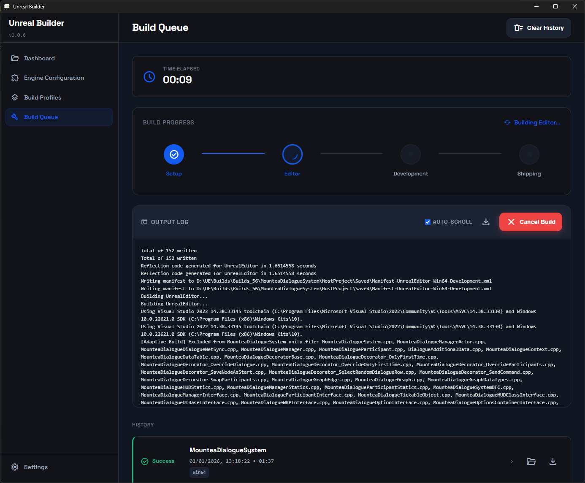
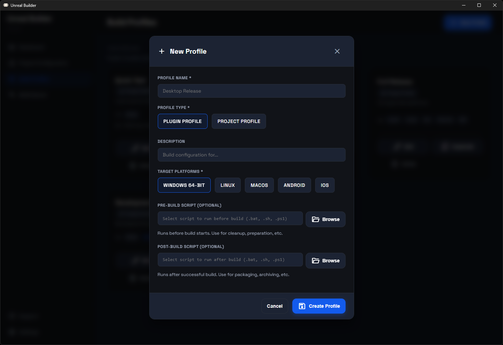
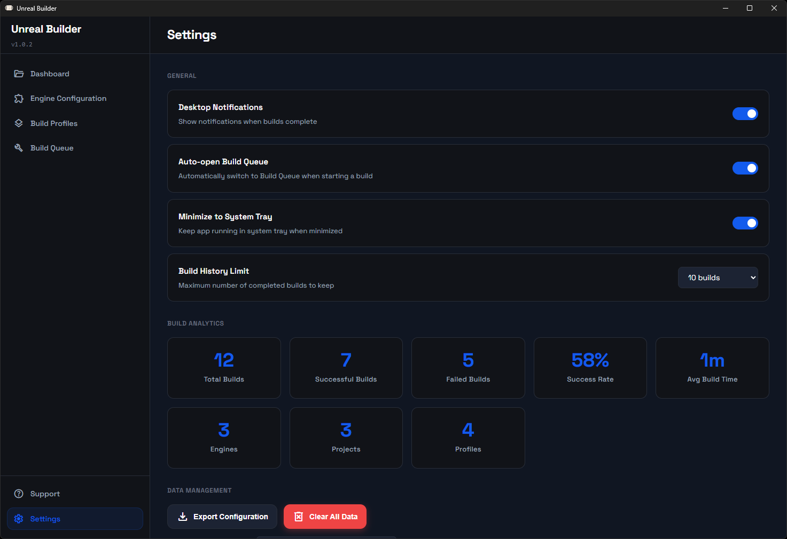

# Unreal Builder

A desktop application for automating Unreal Engine plugin and project builds across multiple engine versions and platforms.



## Overview

Unreal Builder streamlines the process of building Unreal Engine plugins and projects by providing a centralized interface for managing multiple engine versions, build configurations, and target platforms. The application handles the complex UAT (Unreal Automation Tool) commands and provides real-time feedback on build progress.

## Key Features

### Multi-Engine Support
Manage multiple Unreal Engine installations from a single interface. Automatically detects engine versions installed on your system and allows you to build the same plugin or project for different engine versions.



### Plugin and Project Support
Build both Unreal Engine plugins and standalone projects. The application automatically adjusts build parameters and UI based on the file type selected.

**Plugins:**
- Build for multiple platforms simultaneously
- Generates Editor, Development, and Shipping configurations
- Outputs ready-to-distribute plugin packages

**Projects:**
- Build complete game projects
- Cook content and package for distribution
- Select Development or Shipping configurations
- Single platform per build with queueing support

### Build Queue System
Queue multiple builds and let them process sequentially. Useful when building for multiple platforms or testing across different engine versions.



Features:
- Real-time build progress with stage visualization
- Live log output with auto-scroll
- Cancel builds in progress
- Export build logs for debugging
- Build history with success/failure tracking

### Build Profiles
Create reusable build profiles with preset platform configurations. Quickly switch between common build scenarios without reconfiguring platforms each time.



### Build Analytics
Track build statistics over time:
- Total builds executed
- Success and failure rates
- Average build times
- Per-platform statistics

### System Tray Integration
Minimize the application to the system tray and continue builds in the background. Useful for long-running builds that don't require constant monitoring.

### Build Pipeline Visualization
Real-time visualization of build stages with progress indicators:

**Plugin Builds:**
1. Setup - Initialize build environment
2. Editor - Build editor binaries
3. Development - Build development runtime
4. Shipping - Build shipping runtime

**Project Builds:**
1. Setup - Initialize build environment
2. Cook - Cook game content
3. Build - Compile game binaries
4. Stage - Stage cooked content
5. Package - Create distribution package

## Installation

### Requirements
- Windows 10/11, macOS 10.14+, or Linux
- Unreal Engine 4.27 or 5.x installed
- 4GB RAM minimum
- A bunch of free disk space for builds

### Download
Download the latest release for your platform:
- Windows: `Unreal Builder Setup.exe` or `Unreal Builder.exe` (portable)
- macOS: `Unreal Builder.dmg`
- Linux: `Unreal Builder.AppImage` or `.deb` package

### Windows Installation
1. Run the installer
2. Follow installation wizard
3. Launch from Start Menu or Desktop shortcut

### macOS Installation
1. Mount the DMG file
2. Drag Unreal Builder to Applications folder
3. Launch from Applications

### Linux Installation

**AppImage:**
```bash
chmod +x Unreal-Builder.AppImage
./Unreal-Builder.AppImage
```

**Debian Package:**
```bash
sudo dpkg -i unreal-builder_1.0.0_amd64.deb
```

## Getting Started

### 1. Configure Engine Versions



Navigate to Engine Configuration and add your installed Unreal Engine versions:

1. Click "Add Engine"
2. Browse to engine installation folder
3. Application automatically detects version
4. Save configuration

Example engine paths:
- Windows: `C:\Program Files\Epic Games\UE_5.6`
- macOS: `/Users/Shared/Epic Games/UE_5.6`
- Linux: `/home/user/UnrealEngine/Engine`

### 2. Add a Plugin



From the Dashboard:

1. Click "New Project"
2. Select "Plugin" as project type
3. Click "Browse" and select your `.uplugin` file
4. Project name is auto-filled from filename
5. Select engine version
6. Choose target platforms:
   - Windows 64-bit
   - Linux
   - macOS
   - Android
   - iOS
7. Select output directory for built plugin
8. Click "Create Project"

### 3. Add a Project



From the Dashboard:

1. Click "New Project"
2. Select "Project" as project type
3. Click "Browse" and select your `.uproject` file
4. Project name is auto-filled from filename
5. Select engine version
6. Choose target platform (one at a time)
7. Select build configuration:
   - Development (with debug symbols)
   - Shipping (optimized, no debug)
8. Select output directory
9. Click "Create Project"

### 4. Start a Build



From the Dashboard:

1. Find your plugin or project
2. Click "Build" button
3. Application switches to Build Queue page
4. Monitor real-time progress:
   - Current build stage
   - Elapsed time
   - Live log output
5. Wait for completion or cancel if needed

### 5. Using Build Profiles (Optional)



Build profiles allow quick switching between platform configurations:

1. Navigate to Build Profiles page
2. Click "New Profile"
3. Name your profile (e.g., "Desktop Platforms")
4. Select platforms for this profile
5. Save profile

To use a profile:
1. On Dashboard, find your project
2. Select profile from dropdown
3. Click "Build"
4. Project builds with profile's platform settings

## Configuration

### Settings



Access settings from the sidebar:

**Notifications:**
- Enable/disable build completion notifications
- Desktop notifications when builds finish

**Build Queue:**
- Auto-open Build Queue when build starts
- Automatically switches to queue page

**Build History:**
- Maximum builds to keep in history
- Older builds are automatically cleaned up

**System Tray:**
- Minimize to system tray
- Continue builds in background
- Click tray icon to restore window

### Output Folder Structure

After a successful build:

**Plugin Output:**
```
OutputFolder/
└── PluginName/
    ├── Binaries/
    ├── Content/
    ├── Resources/
    └── PluginName.uplugin
```

**Project Output:**
```
OutputFolder/
└── ProjectName/
    └── WindowsNoEditor/  (or LinuxNoEditor, etc.)
        ├── ProjectName.exe
        └── ProjectName/
            ├── Content/
            └── Binaries/
```

## Build Queue Management

### Queue Controls

- **Cancel Build**: Stops the current build immediately
- **Clear History**: Removes all completed builds from history
- **Export Logs**: Save build logs to text file for debugging

### Build Status

Each build shows:
- Current status (Queued, Building, Success, Failed)
- Build duration
- Platform(s) being built
- Completion timestamp

### Log Viewer

The integrated log viewer provides:
- Real-time output from Unreal Automation Tool
- Auto-scroll to latest output
- Manual scroll for reviewing earlier output
- Color-coded error messages
- Export capability for bug reports

## Advanced Features

### Multiple Platform Builds

**Plugins:**
Select multiple platforms and build all at once. The build system compiles binaries for each platform in sequence.

**Projects:**
Queue separate builds for each platform. For example, to build for Windows and Linux:
1. Create build for Windows Development
2. While first build runs or is queued, create another for Linux Development
3. Builds process sequentially

### Engine Version Testing

Test plugin compatibility across multiple engine versions:
1. Add plugin multiple times, each with different engine version
2. Queue builds for all versions
3. Compare results to identify compatibility issues

### Build Analytics

Track build performance over time:
- **Success Rate**: Percentage of successful builds
- **Average Build Time**: Mean duration across all builds
- **Platform Statistics**: Success rates and times per platform
- **Recent Activity**: Quick view of latest build results

## Keyboard Shortcuts

- `Ctrl+1`: Navigate to Dashboard
- `Ctrl+2`: Navigate to Engine Configuration
- `Ctrl+3`: Navigate to Build Queue
- `Ctrl+4`: Navigate to Build Profiles
- `Ctrl+,`: Open Settings
- `Ctrl+B`: Start build (when project selected)
- `Ctrl+Shift+X`: Cancel current build

## Troubleshooting

### Engine Not Detected

**Problem:** Engine not showing in dropdown when adding project

**Solution:**
1. Navigate to Engine Configuration
2. Manually add engine installation
3. Verify path points to engine root folder
4. Ensure `Engine/Build/BatchFiles/RunUAT.bat` exists

### Build Fails Immediately

**Problem:** Build fails in Setup stage

**Common Causes:**
- Incorrect engine path
- Missing UAT dependencies
- File permissions

**Solutions:**
1. Verify engine installation is complete
2. Run Unreal Builder as administrator (Windows)
3. Check build logs for specific error messages
4. Ensure output directory is writable

### Build Hangs

**Problem:** Build appears stuck at certain stage

**Solution:**
1. Check log output for errors
2. Verify sufficient disk space
3. Ensure engine version matches project requirements
4. Try canceling and restarting build

### Missing Platforms

**Problem:** Cannot build for certain platforms

**Causes:**
- Platform SDK not installed
- Engine not built with platform support

**Solutions:**
1. Install required platform SDKs
2. Rebuild engine with platform support enabled
3. Verify platform files exist in engine installation

### Plugin Won't Load After Build

**Problem:** Built plugin doesn't load in engine

**Common Issues:**
1. Plugin built for wrong engine version
2. Module names don't match
3. Dependencies missing

**Solutions:**
1. Verify engine version matches
2. Check .uplugin file for correct module names
3. Review build logs for compilation errors
4. Ensure all dependencies are included

## Building from Source

### Prerequisites
- Node.js 18 or higher
- Git

### Clone Repository
```bash
git clone https://github.com/Mountea-Framework/MounteaUnrealBuilder.git
cd unreal-builder
```

### Install Dependencies
```bash
npm install
```

### Development Mode
```bash
npm start
```

### Build for Production
```bash
npm run build
```

### Create Distribution
```bash
npm run dist:win   # Windows
npm run dist:mac   # macOS
npm run dist:linux # Linux
```

## Project Structure

```
unreal-builder/
├── src/
│   ├── main/           # Main process (Electron)
│   │   ├── main.ts     # Application entry point
│   │   └── builder.ts  # Build execution logic
│   ├── preload/        # Preload scripts
│   │   └── preload.ts  # IPC bridge
│   ├── renderer/       # Renderer process (React)
│   │   ├── pages/      # Application pages
│   │   ├── styles.css  # Global styles
│   │   └── App.tsx     # Main React component
│   └── shared/
│       └── types.ts    # Shared TypeScript types
├── assets/
│   ├── icon.ico        # Windows icon
│   ├── icon.icns       # macOS icon
│   └── icon.png        # Linux icon
└── package.json        # Dependencies and scripts
```

## Technology Stack

- **Electron**: Cross-platform desktop framework
- **React**: User interface library
- **TypeScript**: Type-safe JavaScript
- **Webpack**: Module bundler
- **Unreal Automation Tool**: Build backend

## Contributing

Contributions are welcome. Please follow these guidelines:

1. Fork the repository
2. Create a feature branch
3. Commit changes with clear messages
4. Push to your fork
5. Submit a pull request

## Support

For issues, questions, or feature requests:
- GitHub Issues: [Link to issues page]
- Documentation: [Link to docs]

## License

This project is licensed under the ISC License. See LICENSE file for details.

## Acknowledgments

Built with Unreal Engine developer workflows in mind. Special thanks to the Unreal Engine community for feedback and testing.

## Version History

### 1.0.0 (Current)
- Initial release
- Plugin build support
- Project build support
- Multi-engine support
- Build queue system
- Build profiles
- Build analytics
- System tray integration
- Real-time build logs
- Cross-platform support (Windows, macOS, Linux)
